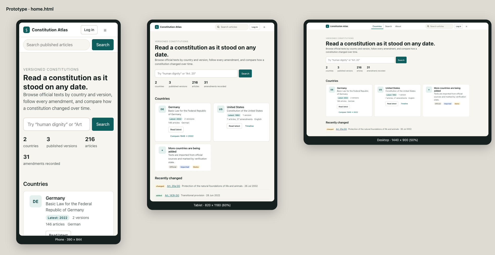
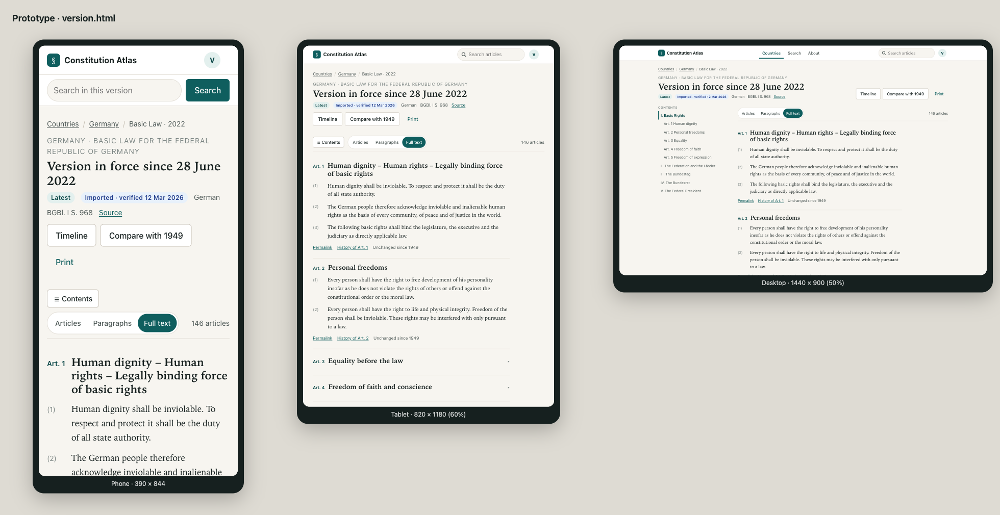
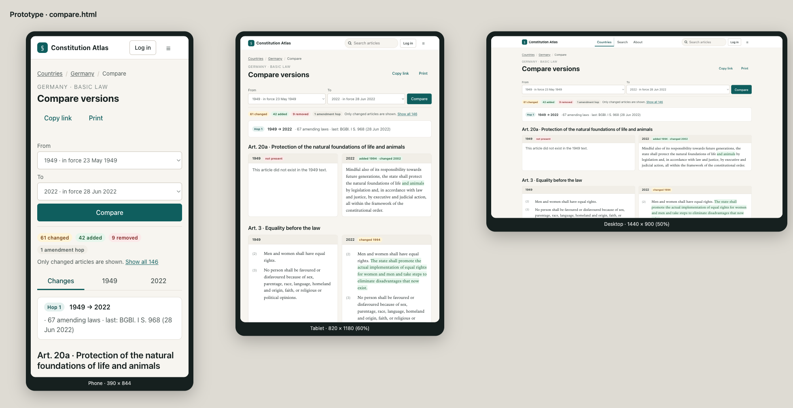
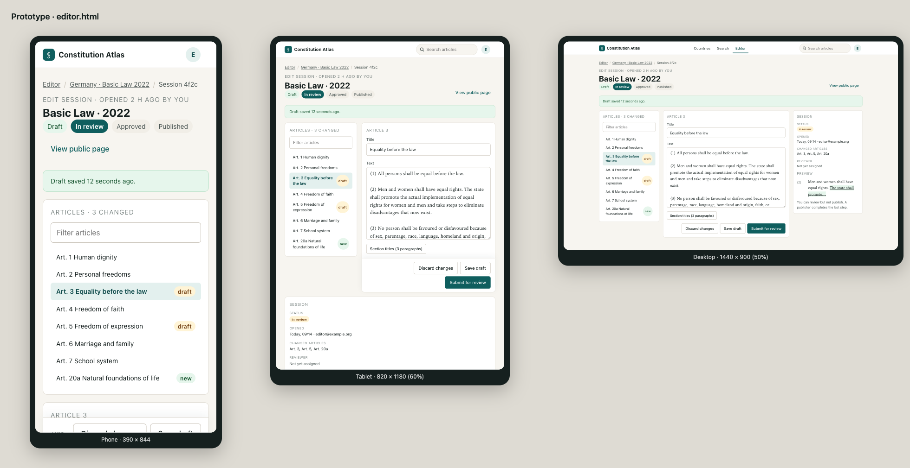

# Constitution Atlas — UI concept (redesign)

Status: proposal for Sprints 19–21 (`backlog.md`, IDs UI-29 … UI-39).
Companion files: [`role-link-trees.md`](role-link-trees.md), [`tokens.css`](tokens.css), [`prototype/`](prototype/), [`screenshots/`](screenshots/).

The prototype is plain HTML/CSS with no build step. Open `prototype/board.html?page=home|version|compare|editor` in a browser (serve `docs/design` with any static server, e.g. `python3 -m http.server`) to see every page at phone, tablet, and desktop width at once.

| Home | Version reader |
| --- | --- |
|  |  |

| Compare | Editor workspace |
| --- | --- |
|  |  |

## 1. Goals and principles

The product is a reference work. The UI should feel like a well-set legal edition on any screen, not like an admin tool.

1. **Text first.** Constitutional text is rendered in a serif reading face at a fixed measure (`--measure: 68ch`); everything else (chrome, forms, metadata) uses the system sans-serif. The reader is never more than one tap from the text.
2. **One shell, three widths.** Every page uses the same top bar, page header, and footer. Layout changes happen at exactly two breakpoints: `640px` (phone → tablet) and `1024px` (tablet → desktop). No page has a fourth layout.
3. **Progressive disclosure, no dead ends.** Long content collapses (hops, articles, filters) but every page offers the next step: previous/next, history, compare, timeline, search-in-version.
4. **Role-aware, not role-locked.** Navigation shows what the current principal may do (see `role-link-trees.md`). Hiding a link is never authorisation; the backend still rejects.
5. **Trust cues are visible, never loud.** Provenance (source, gazette, verification, language, official/imported/demo) sits in the page header meta line and in a compact `Provenance` block, styled as badges, not banners.
6. **Accessible by default.** WCAG 2.2 AA: 44px targets, visible focus (`--color-focus`, amber on teal), `aria-current`, landmarks, no colour-only meaning (every added/changed/removed badge carries text), keyboard-complete menus, `lang` attributes on constitutional text.
7. **No new runtime dependencies.** Plain CSS custom properties and the existing `app/components/ui.tsx` primitives; client components only for the menu disclosure, detail segmented control, compare tabs, and the editor.

## 2. Layout system

| Token | Value | Use |
| --- | --- | --- |
| `--content-max` | `1200px` | Width of top bar content and wide pages (home, compare, editor, admin) |
| `--measure` | `68ch` | Reading column; `.page-narrow` caps a page at measure + gutters (article, login, account) |
| `--sidebar-w` | `280px` | Table of contents column on desktop |
| `--gutter` | `clamp(16px, 4vw, 32px)` | Horizontal padding |
| `--topbar-h` | `56px` | Sticky offsets for toolbars |

### Breakpoints

| Width | Name | Shell | Reader | Compare | Editor |
| --- | --- | --- | --- | --- | --- |
| `< 640` | phone | Brand + avatar/menu button; search in a second row under the bar | One column; "Contents" button opens the TOC as a disclosure above the text; sticky detail control | One column; tabs **Changes / From / To** switch what is shown | Stacked panels; sticky bottom action bar |
| `640–1023` | tablet | Brand + inline pill search + menu button; no primary nav | One column, TOC still behind the button | Two columns side by side; no tabs | Article list (260px) + editor; session panel below, full width |
| `≥ 1024` | desktop | Brand + centred primary nav + search + account menu | TOC column (`--sidebar-w`) + text column | Two columns | Three columns: articles 260px, editor, session panel 300px sticky |

Rules a junior developer can apply everywhere:

- Use `min-width` media queries only (`@media (min-width: 640px)`, `@media (min-width: 1024px)`).
- Never set widths in pixels inside components; use the tokens above or `minmax(0, 1fr)`.
- Anything sticky is offset by `var(--topbar-h)`; do not stack more than one sticky bar under the top bar.
- Tables become card lists on phones (`.data-list` / `.data-row`, see prototype CSS).

## 3. Application shell

**Top bar** (`SiteHeader.tsx`, rewrite): sticky, white, 1px bottom border.

- Left: brand mark (teal rounded square with §) + "Constitution Atlas". Links to `/`.
- Centre (desktop only): primary nav from `primaryNavLinks(user)`, current page marked with `aria-current="page"` and a 3px underline.
- Right: pill search (`≥ 640`), then either **Log in** button (anonymous) or an **avatar** button (initial of email) that opens the account menu; on phones a **☰** button opens the full menu.
- Menu panel: one `
`-style disclosure (client component with Escape/outside-click close). Groups in this order: user identity (email + role badges), primary destinations (phone only), Editorial (if any editorial role), Admin (admin only), Account + Sign out. Exact contents per role are in `role-link-trees.md`.
- Phone search row: full-width search input under the bar on public pages; on version/article pages the placeholder becomes "Search in this version" and the form carries `versionId`.
- Identity outage: a single muted status line under the bar ("Sign-in is temporarily unavailable."), public content unaffected (keeps UI-6).

**Page header** (`PageHeader.tsx`, new): breadcrumbs → eyebrow (context: "Germany · Basic Law") → `h1` → meta line (badges and facts) → actions on the right (wrap under the title on phones). Every route uses it.

**Footer** (`SiteFooter.tsx`, new): one line: trust statement + About / Sources / Accessibility / API docs (admin only).

## 4. Page specifications

Each item lists layout, key components, and what changes versus today.

### 4.1 Home `/`
- Hero: eyebrow, `h1` "Read a constitution as it stood on any date.", lede, large search field, four stats (countries, versions, articles, amendments) from the catalog summary (UI-28 fields).
- "Countries" card grid (1 / 2 / 3 columns): ISO badge, country name, constitution title, badges *Latest: {label}*, versions, articles, language; actions **Read latest**, **Compare latest two** (only if ≥ 2 versions).
- "Recently changed" list: last 5 amendment changes across all countries (badge + article + date). Data: `listAmendments` for latest versions; degrade silently if amendment service is down.

### 4.2 Country `/countries/[code]`
- Page header with ISO badge and country name; meta: number of constitutions/versions.
- One card per constitution; inside, a horizontal chip row of versions in canonical order (latest marked), and actions **Timeline**, **Compare**.

### 4.3 Version reader `/countries/[code]/versions/[versionId]`
- Header: eyebrow "Germany · Basic Law", `h1` "Version in force since {date}", meta badges (Latest, verification, language, gazette, Source link), actions **Timeline**, **Compare with previous**, **Print**.
- Toolbar (sticky under the top bar): **Contents** button (phone/tablet), segmented detail control replacing the range slider (labels come from `depthStopLabels(outline)`, e.g. Articles / Paragraphs / Full text), article count on the right.
- Desktop: TOC column listing outline groups and articles, `aria-current` follows scroll (IntersectionObserver in a small client component).
- Text column: article header = accent article number + serif title; paragraphs as a `2.5rem 1fr` grid with the paragraph number in the gutter; article footer with Permalink, History of Art. N, and "Unchanged since {label}" or a changed badge.
- Collapsed articles use a full-width `article-toggle` button (`aria-expanded`), exactly as `VersionReader.tsx` does today, restyled.
- Pager at the bottom: previous / next outline section.

### 4.4 Article `/countries/[code]/versions/[versionId]/articles/[articleId]`
- `.page-narrow`; same header pattern with actions **History**, **Permalink**, **Print**.
- `Provenance` block above the text; `lang` attribute on the text root.
- Previous / next article pager (UI-22).

### 4.5 Compare `/countries/[code]/compare`
- Sticky **compare bar** with From / To selects and a primary **Compare** button; on tablets and up it is one row.
- Summary badges: N changed / N added / N removed / N hops, plus "Only changed articles are shown · Show all".
- Phone tabs **Changes / From / To** (`role="tablist"`), hidden `≥ 640`.
- Hops as `
` (collapsed by default, unchanged from UI-9), change rows with text badges.
- Per changed article: section title, then two `compare-col` cards with a grey column head (version label + badge) and serif text; `<ins>`/`<del>` styled with the added/removed pairs, ready for UI-10 structured diff.

### 4.6 Timeline `/countries/[code]/timeline`
- Vertical timeline: date on the left, card on the right with version label, amending law citation, changed-article badges, and **Compare with previous** / **Read** actions. One column on phones (date above card).

### 4.7 Search `/search`
- Header with the query in the `h1` ("Results for “dignity”").
- Desktop: filter sidebar (country, version, date as radio lists with counts) + results; phone/tablet: a **Filters** disclosure above results.
- Result card: article link, constitution · version · date, highlighted snippet (`<mark>`, SRC-6), country name (SRC-7). Paging at the bottom.

### 4.8 Editor `/editor`
- Header: eyebrow "Edit session · opened …", `h1` version, **workflow steps** (Draft → In review → Approved → Published) as pills with `is-done` / `is-current`.
- Workspace grid: articles panel (filter input + list with draft/new badges, `aria-current`), editor panel (title, text area in the serif reading face, collapsible section-title fields), session panel (status, opened by, changed articles, reviewer, live preview).
- Action bar: Discard / Save draft / Submit for review (editor), Approve (reviewer), Publish (publisher). Sticky at the bottom on phone and tablet.
- Landing state when no session is open: cards **Open a session** (version select) and **Load a session** (id), plus for reviewers/publishers a **Review queue** list (sessions in `reviewing` / `approved`).

### 4.9 Admin `/admin/*`
- Users, Outlines, Import share one layout: page header with a primary action, `.data-list` rows (table on tablet+, cards on phone), inline status badges, and the existing forms wrapped in `Card`s.

### 4.10 Account, login, invite, reset
- `.page-narrow`, one centred `Card`, no sidebar, footer visible. Error/success `Alert` above the form.

## 5. Component inventory

Existing primitives in `app/components/ui.tsx` are kept and restyled; new ones are added there or as sibling files.

| Component | Status | Notes |
| --- | --- | --- |
| `Button` (`primary`, `secondary`, `ghost`, size `sm`) | extend | Adds `ghost` and `sm` |
| `Input`, `Select`, `TextArea` | keep | Token restyle only |
| `Alert` (`info`, `success`, `error`) | keep | Coloured background pairs from tokens |
| `Card` | keep | Radius `md`, shadow-1 |
| `Badge` (`accent`, `added`, `removed`, `changed`, `info`, default) | new | Replaces `.tag` |
| `Chip` | new | Version chips, filter chips |
| `PageHeader` | new | Breadcrumbs, eyebrow, title, meta, actions |
| `SiteHeader` | rewrite | Top bar with menu disclosure and search |
| `SiteFooter` | new | |
| `MenuDisclosure` | new (client) | Escape/outside click, focus return |
| `Segmented` | new (client) | Replaces the range slider in `VersionReader` |
| `Tabs` | new (client) | Compare on phones |
| `Toc` | new (client) | Sticky contents with scroll-spy |
| `Toolbar` | new | Sticky row under the top bar |
| `DataList` / `DataRow` | new | Responsive table |
| `Pager` | new | Prev/next pair |
| `WorkflowSteps` | new | Editor status pills |
| `Provenance` | keep | Restyle to `.provenance` grid |
| `ConstitutionText` | keep | Adds `.text-column`, `.para` grid, `lang` |

## 6. Design tokens

Defined in [`tokens.css`](tokens.css); copy into `globals.css` in UI-29 and delete the old `--ink/--paper/--line/--accent/--added/...` names after all usages are migrated (grep `var(--ink)` etc.).

- **Colour:** ink `#16201f`, paper `#f7f5f0`, surface white, line `#e2ded6`, accent teal `#0f5e5e` (AA on white and paper), soft accent `#e3f0ee`. Semantic pairs for added/removed/changed/info each have a background and a foreground that pass AA against each other. Focus ring is amber `#d97706` so it is visible on teal buttons.
- **Type:** UI = `system-ui` stack; text = `Iowan Old Style / Palatino / Georgia`; sizes `xs … 3xl` with `clamp()` on the two display sizes. Reading body `1.0625rem / 1.65`.
- **Space:** 4px scale `--space-1 … --space-8`.
- **Shape:** radii 6 / 10 / 16 / pill; two shadows.
- Dark mode is out of scope (as stated in UI-13); tokens make it possible later by redefining `:root` under `prefers-color-scheme`.

## 7. Prototype files

| File | Shows |
| --- | --- |
| `prototype/home.html` | Anonymous shell, hero, country cards, recently changed |
| `prototype/version.html` | Viewer shell, TOC + toolbar + text column, collapsed articles, pager |
| `prototype/compare.html` | Compare bar, summary badges, phone tabs, hop, two-column diff |
| `prototype/editor.html` | Editor/reviewer shell with Editorial menu group, workflow steps, three-panel workspace, sticky action bar |
| `prototype/board.html?page=…` | Renders any page in phone (390), tablet (820) and desktop (1440) frames |
| `prototype/prototype.css` | All component styles; class names are the implementation contract |

## 8. Migration plan (maps to Sprints 19–21)

1. **Foundation (UI-29 … UI-32):** tokens into `globals.css`; typography reset; `PageHeader`, `SiteFooter`, `Badge`, `Chip`, `Pager`, `DataList`; new `SiteHeader` with `MenuDisclosure`; role link trees in `lib/nav.ts` (`menuSections(user)` returning grouped sections; `primaryNavLinks` stays for the desktop bar). Old class names keep working during the sprint via a thin alias block that is removed at the end of Sprint 21.
2. **Public pages (UI-33 … UI-36):** home, country, version reader (Toc, Segmented, Toolbar), article, timeline, search.
3. **Compare, editor, admin, verification (UI-37 … UI-39):** compare tabs and columns, editor workspace and workflow steps, admin data lists, account/login cards; then re-baseline UI-14 visual tests and re-run axe.

Every page migration is one PR: swap the shell, apply the class names from `prototype.css`, run `npm run lint && npm run build`, and check the three widths in the browser dev tools (390, 820, 1440).
